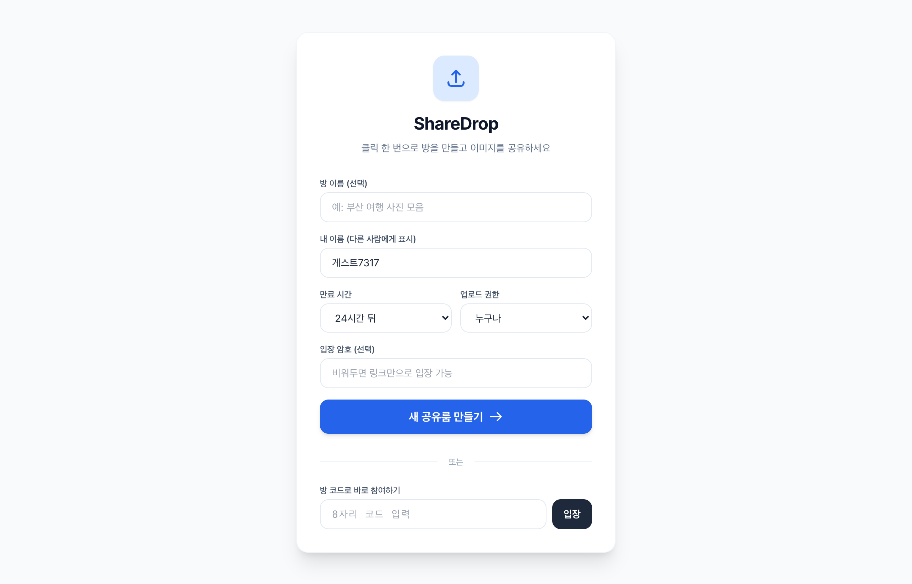
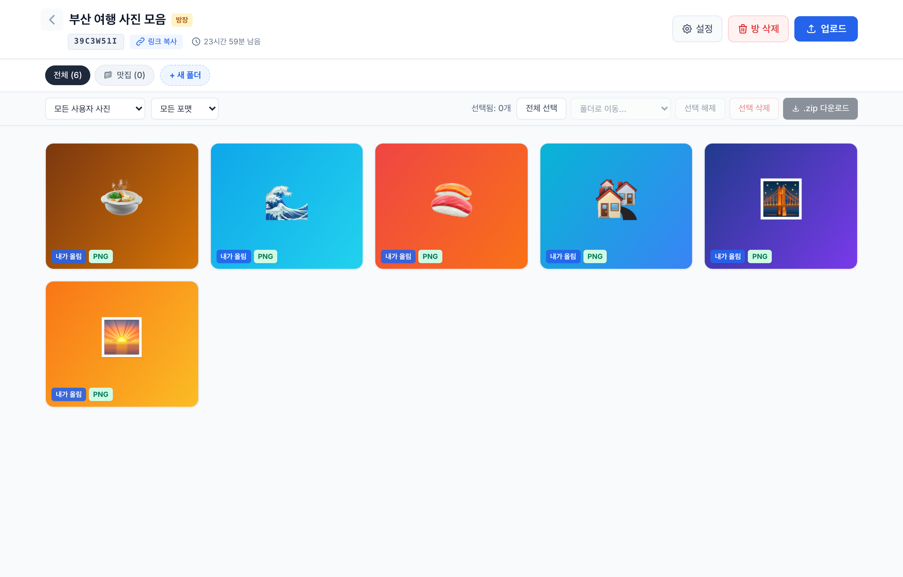

# ShareDrop 📤

**링크 하나로 여러 명이 이미지·비디오를 빠르고 깔끔하게 공유하는 실시간 공유룸**

방을 만들면 8자리 코드(또는 링크)가 생기고, 그 링크를 받은 사람은 로그인 없이 바로 입장해 사진·영상을 올리고 내려받을 수 있습니다.

🔗 **데모: [share-drop-one.vercel.app](https://share-drop-one.vercel.app)**

|  방 만들기 / 입장  |  갤러리  |
| :---: | :---: |
|  |  |

---

## ✨ 주요 기능

### 방(공유룸)
- **클릭 한 번으로 방 생성** → 공유용 8자리 코드 + 초대 링크 발급
- **로그인 불필요** — 코드나 링크만으로 입장 (해시 라우팅, 브라우저 뒤로가기 지원)
- **만료 시간** 설정: 1시간 / 6시간 / 24시간 / 3일 / 7일
- **입장 암호**(선택): SHA-256 해시로 저장, 방 코드를 salt로 사용
- **방장 전용 설정**: 방 이름·만료·업로드 권한·암호 변경, 방 삭제

### 업로드
- **이미지 + 비디오**(mp4/webm/mov) 드래그&드롭 또는 파일 선택
- **여러 장 동시 업로드** + 진행 상태 패널(파일별 대기/진행/완료/실패)
- **실패 시 재시도** 버튼
- 큰 이미지는 자동 리사이즈·압축(GIF는 원본 유지)
- 업로드 즉시 갤러리에 **실시간 반영**(Firestore 구독)

### 보기 · 정리
- 썸네일 그리드 + **크게 보기**(라이트박스, 영상은 인라인 플레이어)
- **폴더**: 버튼 하나로 생성, 파일 선택 후 폴더 이동/새 폴더 만들어 이동
- **필터**: 전체 / 내가 올린 것 / 다른 사람 / 특정 업로더별 / 포맷별(JPG·PNG·GIF·비디오)
- 업로더 이름 배지("내가 올림" 강조)
- 대규모 방 대비 **점진 렌더링**(30개씩 "더 보기")

### 선택 · 다운로드
- **다중 선택**: 체크박스 · Shift 범위 선택 · 드래그(러버밴드) 선택 · 전체 선택
- **개별 다운로드** / **선택 일괄 .zip 다운로드**(JSZip)
- **모바일 사진첩 저장**: Web Share API로 공유 시트 → "이미지 저장"
- **삭제**: 본인이 올린 파일은 본인이, 방장은 전체 삭제 가능

---

## 🛠 기술 스택

| 구분 | 사용 기술 |
|------|-----------|
| 프론트엔드 | Vanilla JavaScript (ES Modules), HTML |
| 스타일 | Tailwind CSS (CDN) |
| 백엔드/DB | Firebase Firestore (실시간 구독) |
| 인증 | Firebase Anonymous Auth |
| 라이브러리 | JSZip (일괄 다운로드) |
| 배포 | Vercel |

> 별도의 빌드 도구(번들러) 없이 정적 파일로 동작합니다. 유일한 빌드 스텝은 환경 변수로부터 Firebase 설정 파일을 생성하는 것입니다.

---

## 📁 프로젝트 구조

```
share-drop/
├─ index.html               # 마크업 (뷰/모달 구조)
├─ css/
│  └─ styles.css            # 커스텀 스타일
├─ js/
│  ├─ app.js                # 앱 로직 (라우팅·업로드·갤러리·선택 등)
│  ├─ firebase.js           # Firebase 초기화 + 익명 인증
│  ├─ utils.js              # 순수 유틸(이스케이프·해시·이미지 압축 등)
│  ├─ config.js             # ⚙️ 빌드가 생성 (gitignore)
│  └─ config.example.js     # config.js 형태 예시
├─ scripts/
│  └─ generate-config.mjs   # env → js/config.js 생성 스크립트
├─ firestore.rules          # Firestore 보안 규칙
├─ vercel.json              # 빌드 명령 + 보안 헤더(CSP 등)
├─ .env.example             # 환경 변수 템플릿
├─ SECURITY.md              # 보안 가이드 (콘솔 설정 절차 포함)
└─ BACKLOG.md               # QA·기능 백로그
```

---

## 🚀 로컬 실행

### 1. 저장소 클론
```bash
git clone https://github.com/Uechann/share-drop.git
cd share-drop
```

### 2. Firebase 설정 채우기
[Firebase 콘솔](https://console.firebase.google.com)에서 프로젝트를 만들고 웹 앱 설정값을 확인한 뒤:

```bash
cp .env.example .env
# .env 파일을 열어 FIREBASE_* 값 채우기
```

### 3. 설정 파일 생성 + 서버 실행
```bash
npm run build      # .env → js/config.js 생성
npm start          # 위 build 후 http://localhost:8642 로 정적 서버 실행
```
> `npm start`는 내부적으로 `python3 -m http.server 8642`를 사용합니다. Python이 없다면 아무 정적 서버(`npx serve` 등)로 프로젝트 루트를 열면 됩니다.

브라우저에서 **http://localhost:8642** 접속.

---

## ☁️ 배포 (Vercel)

1. Vercel에 저장소 연결 (또는 `vercel` CLI)
2. Vercel 대시보드 → **Settings → Environment Variables**에 `.env.example`의 키(`FIREBASE_*`)를 Production/Preview/Development에 등록
3. 배포 시 `vercel.json`의 `buildCommand`(`node scripts/generate-config.mjs`)가 환경 변수로부터 `js/config.js`를 자동 생성

```bash
vercel deploy --prod
```

---

## 🔐 보안

설정과 규칙은 [SECURITY.md](SECURITY.md)에 자세히 정리되어 있습니다. 핵심만 요약하면:

- **Firebase apiKey는 비밀키가 아닙니다.** 클라이언트 SDK 특성상 브라우저에 노출되는 것이 정상이며, 실제 접근 제어는 **Firestore 보안 규칙**([firestore.rules](firestore.rules))이 담당합니다.
- 환경 변수 분리는 "브라우저에서 숨기기"가 아니라 **"공개 저장소 소스에서 값 제거"**가 목적입니다.
- 보안 헤더(CSP, X-Frame-Options 등)를 `vercel.json`에서 적용합니다.
- 사용자 입력(닉네임·파일명·폴더명)은 XSS 방지를 위해 이스케이프 처리합니다.

### ⚠️ 배포 후 반드시 해야 할 콘솔 설정 (순서 중요)
1. **Authentication → 익명(Anonymous) 로그인 활성화**
2. **Firestore → 규칙**에 `firestore.rules` 내용 붙여넣고 게시
3. (권장) **Firestore → TTL**로 `expiresAt` 만료 문서 자동 삭제 설정

---

## 📌 알려진 한계 (프로토타입)

이 프로젝트는 데모/학습용 프로토타입으로, 실서비스 전환 시 아래를 고려해야 합니다.

- **Base64 저장 구조**: 파일을 Firestore 문서에 Base64로 저장하므로 **이미지 ~1MB, 비디오 ~700KB** 제한이 있습니다. 실사용은 **Firebase Storage** 전환이 필요합니다.
- **입장 암호는 데모 수준**입니다. 방 문서가 공개 읽기라 해시 검증이 클라이언트에서 이뤄집니다.
- **방 코드 = 접근 권한**: 코드를 아는 사람은 누구나 열람 가능(링크 공유 모델).

자세한 개선 항목은 [BACKLOG.md](BACKLOG.md) 참고.

---

## 📄 라이선스 · 목적

우아한테크코스 학습용으로 만든 프로토타입입니다. 별도 라이선스 파일은 없으며, 공개 라이선스(예: MIT)를 적용하려면 `LICENSE` 파일을 추가하세요.
